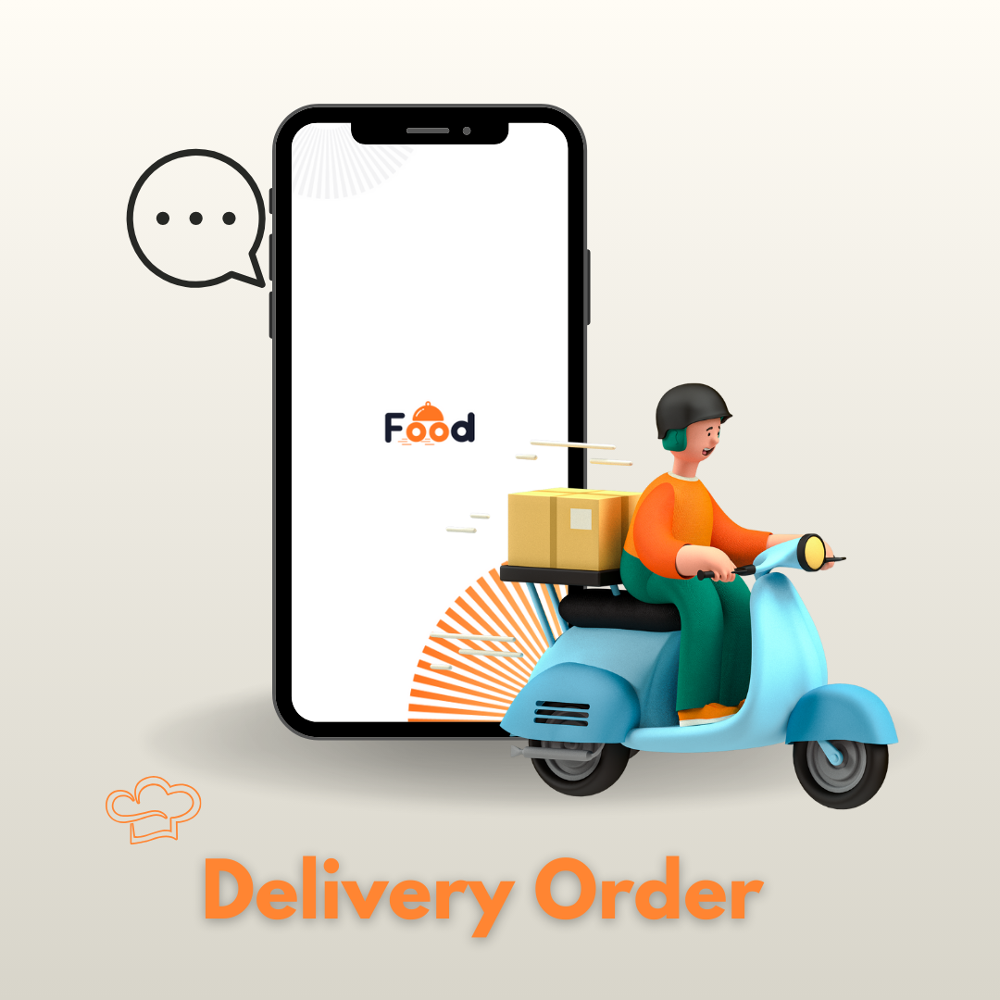

---

<p align="center">
  
</p>

<h1 align="center">🍔 Food Delivery App</h1>

A complete **Food Delivery Application** built using **Flutter** with a **Laravel backend**.  
This project provides a smooth food ordering experience with features like authentication, cart, payments, real-time messaging, and more.  
The app design is based on this [Figma design](https://www.figma.com/design/putgCPh35VOohRyAHFmdkE/Food-Delivery-App--Community-?node-id=190-628).  

## ✨ Features  

- **Authentication**: Sign up, login, OTP verification, password reset  
- **Onboarding** with smooth page indicators  
- **Home Page** with restaurants, categories & offers  
- **Menu & Search**: Browse meals & search functionality  
- **Cart Management**: Add/remove meals & manage orders  
- **Favorites**: Save favorite meals/restaurants  
- **Orders Tracking**: Track current & past orders  
- **Payment Integration**: Stripe payment support  
- **Address Management**: Save and update delivery addresses  
- **Reviews & Ratings** for meals/restaurants  
- **Chef Module** (separate part for chefs/restaurants)  
- **Real-time Chat & Notifications** with **Pusher**  
- **Google Maps Integration** for location & delivery tracking  
- **Offline Support** with internet state handling  
- **Splash Screen** with animation  

---

## 🏛️ Architecture Pattern

This project follows **Clean Architecture** with a **Feature-based folder structure**, ensuring scalability, testability, and separation of concerns.

- **Core Layer**  
  Contains shared utilities, error handling, network configurations, dependency injection, and reusable widgets.

- **Features Layer**  
  Each feature (e.g., `auth`, `cart`, `menu`) is an independent module with its own data, presentation (UI), and business logic.

- **State Management**  
  Implemented using **Bloc/Cubit** from `flutter_bloc` for predictable state management.

- **Navigation**  
  Handled using **GoRouter**, located inside `core/helper/router.dart`.

---

## 📂 Project Structure

```bash

lib/
├── core/
│   ├── cache/                 # Local storage (Hive, SharedPreferences, etc.)
│   ├── dependency_injection/  # Service locator (GetIt) setup
│   ├── error/                 # Error handling & exceptions
│   ├── helper/                # General helpers & utilities (includes router.dart)
│   ├── network/               # API, Dio client, interceptors
│   ├── utils/                 # Styles, constants, colors, themes
│   └── widgets/               # Reusable shared widgets
│
├── features/
│   ├── address/               # Address management
│   ├── auth/                  # Authentication
│   ├── cart/                  # Cart functionality
│   ├── chef_part/             # Chef dashboard/related features
│   ├── favorites/             # Favorite meals
│   ├── forget_password/       # Password reset
│   ├── home/                  # Home screen
│   ├── internet/              # Connectivity checks
│   ├── menu/                  # Menu browsing & item details
│   ├── messages/              # Real-time chat
│   ├── onBoarding/            # Onboarding flow
│   ├── orders/                # Order tracking & history
│   ├── payment/               # Payment integration
│   ├── reviews/               # User reviews & ratings
│   ├── search/                # Search functionality
│   └── splash/                # Splash screen
│
└── main.dart                  # Entry point

```
---

## 🛠️ Technologies Used  

### 📱 Flutter & Dart  
- Flutter SDK (3.x)  
- Dart  

### 🚀 State Management  
- **BLoC / Cubit**  

### 📦 Dependency Injection  
- **get_it** (Service Locator)  

### 🌐 Networking & APIs  
- **Dio** for API requests  
- **Dartz** for functional programming  

### 🔒 Storage & Security  
- **shared_preferences** (local storage)  
- **flutter_secure_storage** (secure tokens)  

### 💳 Payment  
- **flutter_stripe** (Stripe payment integration)  

### 🗺️ Location & Maps  
- **geolocator**  
- **google_maps_flutter**  

### 📡 Real-time  
- **pusher_channels_flutter** (chat & notifications)  
- **connectivity_plus** (internet monitoring)  

### 🎨 UI & UX  
- **sizer** (responsive design)  
- **hexcolor** (custom colors)  
- **svg_flutter** (SVG assets)  
- **lottie** (animations)  
- **smooth_page_indicator** (onboarding)  
- **cached_network_image** (optimized image loading)   
- **emoji_picker_flutter** (emoji support)  
- **pin_code_fields** (OTP inputs)  
- **redacted** (loading placeholders)  
- **modal_progress_hud_nsn** (loading overlay)  
- **fluttertoast** (toast messages)  

### 🔧 Utilities  
- **intl** (date & number formatting)  
- **url_launcher** (open external links)  

---

## 📦 Dependencies  

```yaml
dependencies:
  flutter:
    sdk: flutter

  cupertino_icons: ^1.0.8
  sizer: ^3.0.5
  hexcolor: ^3.0.1
  get_it: ^8.0.3
  dartz: ^0.10.1
  svg_flutter: ^0.0.1
  bubble: ^1.2.1
  emoji_picker_flutter: ^4.3.0
  url_launcher: ^6.3.1
  intl: ^0.18.1
  dlibphonenumber: ^1.1.41
  fl_chart: ^1.0.0
  go_router: ^16.1.0
  image_picker: ^1.1.2
  bloc: ^9.0.0
  smooth_page_indicator: ^1.2.1
  cached_network_image: ^3.4.1
  pin_code_fields: ^8.0.1
  flutter_stripe: ^11.5.0
  dio: ^5.8.0+1
  flutter_bloc: ^9.1.1
  lottie: ^3.3.1
  geolocator: ^14.0.2
  fluttertoast: ^8.2.12
  google_maps_flutter: ^2.2.0
  shared_preferences: ^2.5.3
  flutter_secure_storage: ^9.2.4
  modal_progress_hud_nsn: ^0.5.1
  equatable: ^2.0.7
  connectivity_plus: ^6.1.4
  redacted: ^1.0.13
  pusher_channels_flutter: ^2.4.0
```
---

## 🚀 Getting Started  

Follow these steps to run the project locally:  

### 1️⃣ Prerequisites  
Make sure you have the following installed on your system:  
- [Flutter SDK](https://docs.flutter.dev/get-started/install) (3.x recommended)  
- [Dart](https://dart.dev/get-dart)  
- [Android Studio](https://developer.android.com/studio) or [Xcode](https://developer.apple.com/xcode/) (for iOS)  
- Emulator / Physical Device  
- Laravel Backend (make sure the API is running)  

---

### 2️⃣ Clone the repository 
```bash
git clone https://github.com/Amr-3li/food-delivery-app.git
```

### 3️⃣ Navigate to the project folder
```bash
cd food-delivery-app
```

### 4️⃣ Install dependencies
```bash
flutter pub get
```

### 5️⃣ Configure Environment
Add your Stripe publishable key in main.dart or your payment config file.

Make sure you have Google Maps API key added in:
 - android/app/src/main/AndroidManifest.xml
 - ios/Runner/AppDelegate.swift

### 6️⃣ Run the app
```bash
flutter run
```

### 7️⃣ Build APK / IPA (Optional)
```bash
flutter build apk --release
```
